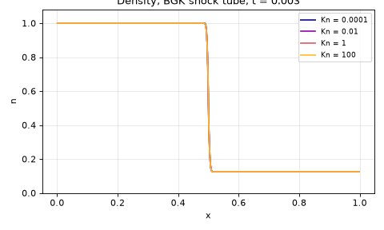
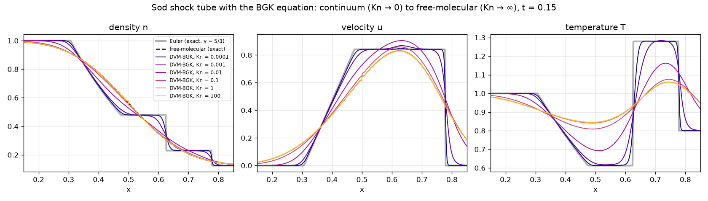
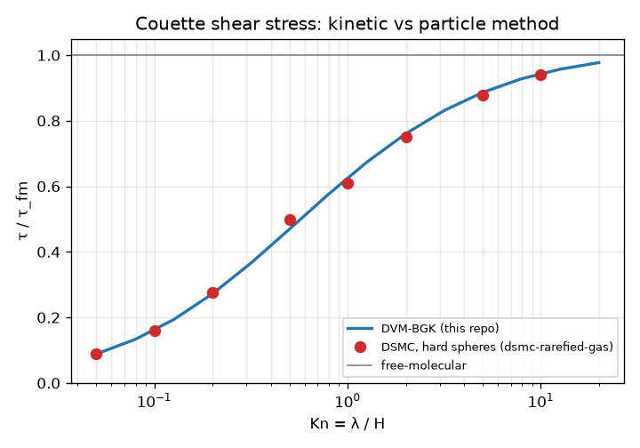
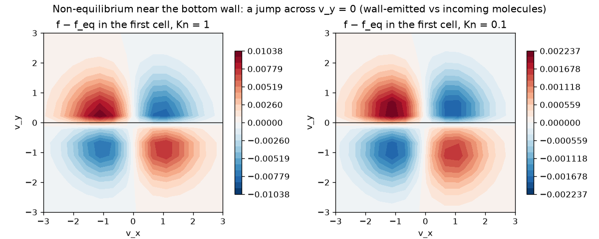

# Boltzmann–BGK Equation with the Discrete Velocity Method

[](https://github.com/cfdgasman/boltzmann-dvm/actions/workflows/ci.yml)

A deterministic kinetic solver for the **BGK model of the Boltzmann equation**, using the **discrete velocity method (DVM)**. It covers every flow regime, from continuum (Kn → 0) to free-molecular (Kn → ∞). The results are validated against:
- the **exact Euler** and **exact collisionless** solutions of the shock tube
- my own **hard-sphere DSMC** code ([dsmc-rarefied-gas](https://github.com/cfdgasman/dsmc-rarefied-gas)) for rarefied Couette flow

<p align="center"></p>

## Model

$$ \partial_t f + \mathbf v\cdot\nabla_{\mathbf x} f = \nu\,(f^{\rm eq} - f),\qquad \nu = \frac{nT}{\mu(T)},\qquad \mu = \mu_{\rm ref}\sqrt{T}, $$

f<sup>eq</sup> is the local Maxwellian with the same density, velocity and temperature as f. The units are m = k = 1. μ<sub>ref</sub> is set so that μ equals the **hard-sphere viscosity** for the hard-sphere mean free path λ, μ = (5√(2π)/16)λ. That makes "Kn" mean the same thing as in the DSMC code.

## Discretisation

**Chu reduction.** The velocity components the flow does not depend on are integrated out. Two reduced distributions carry their mass and energy:

| Problem | reduced unknowns | f<sup>eq</sup> components |
|---|---|---|
| shock tube, f(x, v<sub>x</sub>) | φ = ∫f dv<sub>y</sub>dv<sub>z</sub>, ψ = ∫(v<sub>y</sub>² + v<sub>z</sub>²)f dv<sub>y</sub>dv<sub>z</sub> | φ<sup>eq</sup> = n e<sup>−(v−u)²/2T</sup>/√(2πT), ψ<sup>eq</sup> = 2Tφ<sup>eq</sup> |
| Couette, f(y, v<sub>x</sub>, v<sub>y</sub>) | φ = ∫f dv<sub>z</sub>, ψ = ∫v<sub>z</sub>² f dv<sub>z</sub> | ψ<sup>eq</sup> = Tφ<sup>eq</sup> |

**Velocity space.** Discrete velocities with quadrature weights, so the moments (n, nu, E) = Σ<sub>k</sub> w<sub>k</sub>(1, v<sub>k</sub>, ½v<sub>k</sub>²)φ<sub>k</sub> + … are exact for Maxwellians. Couette uses **Gauss–Hermite** nodes. The shock tube uses a **uniform grid with trapezoidal weights**, which is spectrally accurate for Gaussians. The choice matters, as the results below show.

**Shock tube: IMEX finite volume.** Each discrete velocity is advected with a second-order MUSCL upwind scheme (minmod). The BGK relaxation is then applied **implicitly**:

$$ f^{n+1} = \frac{f^{*} + \Delta t\,\nu\,f^{\rm eq}(M^{*})}{1+\Delta t\,\nu}. $$

Relaxation conserves mass, momentum and energy, so f<sup>eq</sup> can be built from the post-transport moments M\*. The step is stable for any ν and becomes a kinetic scheme for the Euler equations as Kn → 0 (**asymptotic preserving**).

**Couette: characteristics + source iteration.** For each v<sub>y</sub> the steady equation v<sub>y</sub>∂<sub>y</sub>f = ν(f<sup>eq</sup> − f) is integrated **exactly** across each cell, with f<sup>eq</sup> frozen:

$$ f_{\rm out} = f_{\rm in}e^{-\kappa} + f^{\rm eq}(1-e^{-\kappa}),\qquad \bar f = f^{\rm eq} + (f_{\rm in}-f^{\rm eq})\,\frac{1-e^{-\kappa}}{\kappa},\qquad \kappa = \frac{\nu\,\Delta y}{|v_y|}. $$

Molecules are swept upward from the bottom wall and downward from the top wall, and f<sup>eq</sup> is updated from the new moments until converged.

**Walls:** **diffuse reflection** re-emits a wall Maxwellian (T<sub>w</sub> = 1, u = ±U/2) whose density balances the incoming mass flux.

**Debugging note.** Without re-normalising the fixed total mass after each sweep, the iteration drifted slowly and never met a strict tolerance. With it, Kn = 10 converges in 8 iterations and Kn = 0.05 in 700.

## Results

### Shock tube: from Euler to free-molecular flow

<p align="center"></p>

| Kn | L1(n) vs exact Euler | L1(n) vs exact free-molecular |
|---|---|---|
| 10⁻⁴ | **0.0037** | 0.0374 |
| 10⁻³ | 0.0104 | 0.0313 |
| 10⁻² | 0.0277 | 0.0167 |
| 10⁻¹ | 0.0377 | 0.0041 |
| 1 | 0.0404 | 0.0006 |
| 100 | 0.0408 | **0.0004** |

The exact collisionless density is n = ½n<sub>L</sub> erfc(x/(t√(2T<sub>L</sub>))) + ½n<sub>R</sub> erfc(−x/(t√(2T<sub>R</sub>))). The Euler reference is the exact Riemann solution with γ = 5/3, for a monatomic gas. As Kn grows, the shock, contact and rarefaction merge into smooth diffusive fronts, and the temperature overshoot of the shock disappears.

**Ray effect.** In the free-molecular limit each discrete velocity streams as a separate step, so a coarse velocity grid produces a staircase:

| velocities | 21 | 41 | 81 | 161 | 321 |
|---|---|---|---|---|---|
| L1 error | 1.96e-02 | 7.58e-03 | 2.06e-03 | 3.90e-04 | 1.95e-04 |

### Couette flow: kinetic (BGK) vs particle (DSMC) method

<p align="center"></p>

| Kn | DVM-BGK τ/τ<sub>fm</sub> | DSMC τ/τ<sub>fm</sub> | difference |
|---|---|---|---|
| 0.05 | 0.0885 | 0.0888 | −0.3 % |
| 0.1 | 0.1609 | 0.1585 | +1.5 % |
| 0.2 | 0.2722 | 0.2763 | −1.5 % |
| 0.5 | 0.4692 | 0.4979 | −5.8 % |
| 1 | 0.6259 | 0.6106 | +2.5 % |
| 2 | 0.7605 | 0.7511 | +1.3 % |
| 5 | 0.8864 | 0.8768 | +1.1 % |
| 10 | 0.9439 | 0.9400 | +0.4 % |

Two completely independent methods agree within **0.3–2.5 %** across three decades of Kn. One is a deterministic BGK model; the other is stochastic hard-sphere particles. Some difference is expected, because BGK is a *model* collision operator (Prandtl number 1 instead of 2/3). The one larger gap, at Kn = 0.5, comes from the DSMC point, which also sits above Navier–Stokes + slip theory. It is most likely statistical scatter in that single DSMC run.

### Kinetic non-equilibrium at the wall

<p align="center"></p>

Next to a wall, molecules moving away from it (v<sub>y</sub> > 0) were just emitted with the wall's velocity. Molecules moving towards it arrive from the bulk flow. The distribution is therefore **discontinuous across v<sub>y</sub> = 0**. That is the microscopic origin of velocity slip, and something no continuum model can represent. The discontinuity weakens as Kn decreases.

## Usage

```bash
pip install -r requirements.txt
python run.py     # tables, figures and GIF in docs/ (~2 min)
pytest            # quadrature, mass conservation, Euler and free-molecular limits, Couette stress
```

## References

P. L. Bhatnagar, E. P. Gross, M. Krook, *A model for collision processes in gases*, Phys. Rev. 94 (1954) 511–525.
C. K. Chu, *Kinetic-theoretic description of the formation of a shock wave*, Phys. Fluids 8 (1965) 12–22.
L. Mieussens, *Discrete velocity model and implicit scheme for the BGK equation of rarefied gas dynamics*, Math. Models Methods Appl. Sci. 10 (2000) 1121–1149.

## License

MIT
